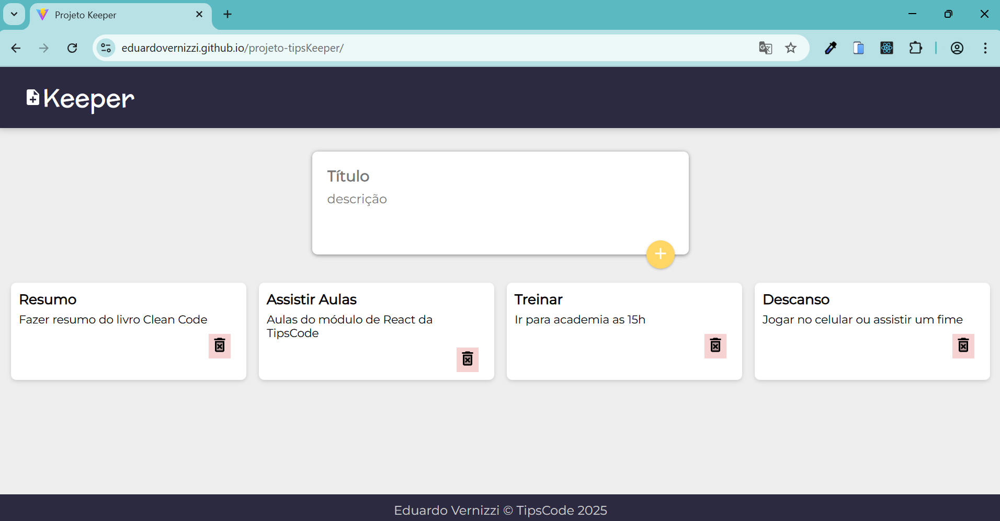

# Projeto TipsKeeper

Aplicação React para criação e gerenciamento dinâmico de notas (tipo post-its), com interface moderna usando Material UI e deploy automático via GitHub Pages.

---

## Preview

---

## Funcionalidades

- Criar notas com título e descrição
- Interface responsiva com Material UI (MUI)
- Botão de adicionar nota que aparece dinamicamente ao clicar no campo título
- Excluir notas individualmente
- Layout em grid que se adapta a diferentes tamanhos de tela
- Deploy automático com GitHub Pages via `gh-pages`

---

## Tecnologias utilizadas

- React 18+
- Vite como bundler
- Material UI v5 (MUI) para componentes e animações
- GitHub Pages para hospedagem

---
